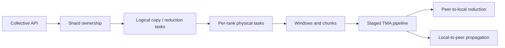

# OOverlap / T-CCL

**Resource-efficient collective communication for NVIDIA Hopper GPUs using the Tensor Memory Accelerator (TMA).**

OOverlap is the implementation repository for **T-CCL**, a collective communication library for intra-node multi-GPU systems. T-CCL uses NVIDIA Hopper's **Tensor Memory Accelerator (TMA)** to offload both inter-GPU data movement and reduction operations, with the goal of achieving high communication performance while consuming fewer Streaming Multiprocessor (SM) resources.

The library currently supports:

* **AllReduce**
* **ReduceScatter**
* **AllGather**
* Single-process multi-GPU execution
* Multi-process execution through CUDA IPC
* Resource-constrained execution through configurable CTA budgets
* Offline launch-configuration tuning
* A public C/C++ API
* PyTorch bindings
* Integration as a communication backend for **vLLM**
* Compute–communication overlap experiments based on a CUTLASS 3.x FlashOverlap port

> **Naming:** the earlier implementation was referred to as *Oh Overlap* / `ooverlap`. The paper presents the TMA-based collective library as **T-CCL**. The repository, public API, environment variables, and Python extensions retain the `ooverlap` name.

---

## Motivation

Collective communication libraries typically use GPU threads and CTAs to move data, perform reductions, and synchronize participating GPUs. This is effective when communication runs by itself, but those communication kernels consume the same SM resources needed by computation.

This becomes especially important when communication and computation are overlapped.

TMA provides dedicated hardware for asynchronous bulk tensor transfers. A small number of GPU threads can issue a transfer and allow the TMA hardware to perform the actual movement while the SM continues with other work. Hopper TMA also supports reduction operations, making it possible to offload a significant part of both the **movement** and **reduction** work required by collectives.

T-CCL builds its collective operations around these capabilities.

---

## Reported Results

The paper evaluates T-CCL on a two-GPU **H100 NVL** system and a four-GPU **GH200** system.

| Evaluation                                     |                                                           Reported result |
| ---------------------------------------------- | ------------------------------------------------------------------------: |
| Standalone collectives, unrestricted resources |                                                  up to **2.4×** over NCCL |
| Standalone collectives, restricted resources   |                                                 up to **3.42×** over NCCL |
| 2-GPU GEMM + collective overlap                | average speedup improves from **1.12× with NCCL** to **1.25× with T-CCL** |
| 4-GPU GEMM + collective overlap                | average speedup improves from **1.04× with NCCL** to **1.14× with T-CCL** |
| vLLM tensor-parallel inference                 |          up to **1.31×** throughput over vLLM automatic backend selection |

These numbers are measurements on the evaluated hardware and software configurations rather than performance guarantees on arbitrary systems. Topology, GPU clocks, CTA budgets, message sizes, and system load can all affect the result.

---

## How It Works

T-CCL separates collective planning from low-level execution.



### Shard-based collective planning

For a collective with `N` participants, the logical tensor is divided into `N` shards. Each rank owns one shard.

For reduction-heavy phases, the owner typically **loads contributions from peer memory and reduces them into its local shard**. Once the final shard has been produced, it can be propagated to the other participating GPUs when required.

This reduces the amount of fine-grained cross-GPU synchronization needed during the collective.

### Tasks, windows, and chunks

The CPU-side planner describes the collective as a set of logical tasks. A task specifies what data should be copied or reduced and where the operation should execute.

Each physical task is divided hierarchically:

```text
Collective
  └── Tasks
       └── Windows
            └── Chunks
```

A **chunk** is the smallest unit processed by the TMA engine. A **window** groups consecutive chunks and provides a convenient progress granularity. A **task** describes a higher-level transfer or reduction between buffers.

### Pipelined TMA execution

T-CCL uses shared memory as a staging area and pipelines TMA operations.

Instead of performing:

```text
load -> wait -> store -> wait -> load -> ...
```

the engine keeps several operations in flight:

```text
load chunk 0
load chunk 1
wait chunk 0
store/reduce chunk 0
load chunk 2
wait chunk 1
store/reduce chunk 1
...
```

Later chunks can therefore be loaded while earlier chunks are still being stored or reduced.

### Resource-aware tuning

More CTAs do not always mean better collective performance. They can improve communication bandwidth while simultaneously taking SM resources away from overlapped computation.

T-CCL therefore includes an offline tuner that evaluates different launch configurations for different collective operations and message sizes. The resulting policy can be used at runtime subject to a maximum communication-resource budget.

---

# Requirements

T-CCL primarily targets **NVIDIA Hopper / SM90** GPUs.

The reported experiments used:

| Component        | Reference environment                 |
| ---------------- | ------------------------------------- |
| GPUs             | 2× NVIDIA H100 NVL or 4× NVIDIA GH200 |
| GPU architecture | Hopper / SM90                         |
| CUDA             | CUDA 13.x environments                |
| Compiler         | GCC 14.x                              |
| Python           | Python 3.13.5 in the evaluated setups |
| vLLM             | 0.25.0                                |
| Build system     | CMake ≥ 3.20                          |
| Language         | C++17 / CUDA C++17                    |

You also need GPU-to-GPU peer access between participating devices.

For the SM-usage experiments, **NVIDIA Nsight Systems (`nsys`)** is additionally required.

---

# Quick Start

## 1. Clone the repository

Clone recursively so that CUTLASS, NCCL, and the other submodules are initialized:

```bash
git clone --recursive https://github.com/ooverlap/ooverlap.git
cd ooverlap
```

If you already cloned without `--recursive`:

```bash
git submodule update --init --recursive
```

The repository currently includes submodules for:

```text
ooverlap/cutlass
nlohmann/json
NVIDIA/nccl
```

---

## 2. Allocate GPUs

OOverlap is intended to be built and run on a GPU node.

For example, on a Slurm system with two H100 GPUs:

```bash
srun \
  --account=<ACCOUNT> \
  --gpus-per-node=H100:2 \
  --time=08:00:00 \
  --pty /bin/zsh
```

A four-GH200 allocation similar to the Arrhenius environment can be requested with:

```bash
srun \
  --account=<ACCOUNT> \
  -p gpu \
  --gres=gpu:nvidia_gh200_120gb:4 \
  --time=08:00:00 \
  --pty zsh
```

It is useful to inspect the selected topology before benchmarking:

```bash
nvidia-smi
nvidia-smi topo -m
```

---

## 3. Set up the environment

The repository contains two setup scripts corresponding to the architectures used for development and evaluation.

### H100 / x86-64

```bash
bash ./setup_env.sh
```

or specify the virtual-environment location explicitly:

```bash
bash ./setup_env.sh /path/to/venv
```

### GH200 / ARM64

```bash
bash ./setup_arm_env.sh /path/to/venv
```

The scripts:

* configure the CUDA/compiler environment,
* create the Python virtual environment,
* install the required Python packages,
* install vLLM 0.25.0,
* apply the OOverlap vLLM communicator integration,
* initialize the required repository dependencies,
* build OOverlap and its Python/PyTorch extensions, and
* generate a reusable runtime environment script.

At the end of setup, the script prints a path similar to:

```text
/path/to/ooverlap_vllm_env.sh
```

Source it before running experiments:

```bash
source /path/to/ooverlap_vllm_env.sh
```

For an x86 machine that already provides a compatible compiler, Python, and CUDA installation, site-specific module loading can be disabled:

```bash
SKIP_MODULES=1 \
bash ./setup_env.sh /path/to/venv
```

---

## 4. Verify GPU peer access

Before running the collectives, verify that the selected GPUs can access each other's memory:

```bash
./scripts/build_and_run_gpu_p2p_access_check.sh
```

The test can also be configured through environment variables:

```bash
CUDA_ARCH=sm_90 \
P2P_ELEMENTS=1048576 \
P2P_ATOMIC_OPS=262144 \
./scripts/build_and_run_gpu_p2p_access_check.sh
```

If peer access is unavailable between the selected GPUs, OOverlap's external-P2P collective path will not work as intended.

---

# Running a Collective

A simple two-GPU AllReduce benchmark can be run with:

```bash
python test/test_external_p2p_collective.py \
  --mode bench \
  --numel 4194304 \
  --iters 100 \
  --warmup 20 \
  --devices 0,1 \
  --collective allreduce
```

For four GPUs:

```bash
python test/test_external_p2p_collective.py \
  --mode bench \
  --numel 4194304 \
  --iters 100 \
  --warmup 20 \
  --devices 0,1,2,3 \
  --collective allreduce
```

Available collective names include:

```text
allreduce
reduce_scatter
all_gather
```

For example:

```bash
OOVERLAP_MAX_CTAS=9 \
OOVERLAP_MAX_CTAS_PER_REDUCE_TASK=3 \
python test/test_external_p2p_collective.py \
  --mode bench \
  --numel 4194304 \
  --iters 100 \
  --warmup 20 \
  --devices 0,1,2,3 \
  --collective reduce_scatter
```

---

# Tuning T-CCL

Launch configuration has a significant effect on both communication performance and communication-side resource consumption.

The tuning script explores multiple values of:

```text
OOVERLAP_MAX_CTAS
OOVERLAP_MAX_CTAS_PER_REDUCE_TASK
```

and generates a runtime policy.

## TP=2

```bash
mkdir -p results/policies

python3 test/sweep_tma_collectives.py \
  --devices 0,1 \
  --policy-out results/policies/tp2_policy.json \
  --raw-out results/policies/tp2_measurements.json \
  --work-dir results/policies/tp2_workers
```

## TP=4

```bash
mkdir -p results/policies

python3 test/sweep_tma_collectives.py \
  --devices 0,1,2,3 \
  --policy-out results/policies/tp4_policy.json \
  --raw-out results/policies/tp4_measurements.json \
  --work-dir results/policies/tp4_workers
```

A generated policy can be selected explicitly with:

```bash
export OOVERLAP_TUNING_POLICY="$PWD/results/policies/tp2_policy.json"
```

or:

```bash
export OOVERLAP_TUNING_POLICY="$PWD/results/policies/tp4_policy.json"
```

Tuning is not required for basic correctness testing, but it is recommended when reproducing performance results.

---

# Runtime Resource Controls

The most useful OOverlap runtime controls are:

| Variable                            | Purpose                                                         |
| ----------------------------------- | --------------------------------------------------------------- |
| `OOVERLAP_MAX_CTAS`                 | Maximum communication CTAs available to OOverlap                |
| `OOVERLAP_MAX_CTAS_PER_REDUCE_TASK` | Maximum CTAs assigned to an individual reduction task           |
| `OOVERLAP_TUNING_POLICY`            | Path to the generated launch-configuration policy               |
| `NCCL_MAX_CTAS`                     | CTA limit for NCCL when running controlled baseline comparisons |

For example:

```bash
OOVERLAP_MAX_CTAS=8 \
OOVERLAP_MAX_CTAS_PER_REDUCE_TASK=8 \
python test/test_external_p2p_collective.py \
  --mode bench \
  --numel 134217728 \
  --iters 100 \
  --warmup 20 \
  --devices 0,1 \
  --collective allreduce
```

Restricting CTAs is particularly useful when studying computation–communication overlap, because it lets communication retain useful bandwidth without consuming all available execution resources.

---

# Reproducing the Standalone Collective Evaluation

> **Repository naming note:** the directory is currently named `evalution/`. Use that spelling in commands.

The fixed paper-evaluation wrapper benchmarks small-message latency and large-message algorithmic bandwidth.

Run all four configurations for the complete TP=2 / TP=4 comparison:

```bash
./evalution/run_external_p2p_bandwidth_latency.sh 2 unres
./evalution/run_external_p2p_bandwidth_latency.sh 2 res

./evalution/run_external_p2p_bandwidth_latency.sh 4 unres
./evalution/run_external_p2p_bandwidth_latency.sh 4 res
```

`unres` selects the unrestricted communication configuration and `res` applies the restricted CTA budget used by the evaluation.

The script evaluates:

```text
Latency:
1 KiB ... 512 KiB

Bandwidth:
1 MiB ... 512 MiB
```

and generates text, CSV, JSONL, speedup summaries, and plots beneath:

```text
results/evalution/external_p2p/
```

---

# Measuring SM Usage

The repository also contains a profiling workflow for measuring average active SM usage.

Usage:

```bash
./evalution/run_external_p2p_sm_usage.sh \
  <tp> <operation> <numel> [<numel> ...]
```

where:

```text
AR = AllReduce
RS = ReduceScatter
AG = AllGather
```

For example:

```bash
./evalution/run_external_p2p_sm_usage.sh \
  4 AG \
  65536 \
  2097152 \
  16777216 \
  67108864
```

This workflow uses Nsight Systems and compares the active-SM behavior of the communication backends.

---

# Compute–Communication Overlap Evaluation

The repository also contains the SM90 port used to evaluate GEMM–collective overlap.

Run the final evaluation with:

```bash
./evalution/run_flashoverlap_sm90.sh 2
```

or:

```bash
./evalution/run_flashoverlap_sm90.sh 4
```

This workflow requires the corresponding CUTLASS GEMM profile/configuration data before it can run.

The intended preparation process is:

1. Build the patched CUTLASS profiler.
2. Generate H100 FP16 GEMM profile CSV files.
3. Generate the OOverlap SM90 GEMM configurations.
4. Generate a T-CCL tuning policy.
5. Run `run_flashoverlap_sm90.sh`.

The repository provides:

```text
scripts/sweep_h100_dense_f16_gemm_same_grid.sh
tool/gen_config_sm90.py
tool/generate_instances_sm90.py
tool/search.py
```

for this process.

The profile sweep uses the GEMM grid:

```text
M = 4096, 8192, 16384, 32768, 49152
N = 2048, 4096, 8192
K = 1024, 2048, 4096, 8192
```

Machine-specific GEMM profiling and configuration generation are intentionally separate from the main OOverlap build, so a clean clone may require these artifacts to be generated before the overlap evaluation is available.

---

# vLLM Integration

The setup scripts install **vLLM 0.25.0** and apply the OOverlap communicator integration.

The evaluation wrapper supports tensor parallelism with:

```text
TP=2 -> Qwen2.5-7B-Instruct
TP=4 -> Qwen2.5-72B-Instruct
```

The model must already exist locally.

For example:

```bash
export VLLM_MODEL_DIR=/path/to/Qwen2.5-72B-Instruct

./evalution/run_vllm_paperlike.sh 4 run
```

To regenerate plots from existing results:

```bash
./evalution/run_vllm_paperlike.sh 4 plot
```

The batch-size sweep uses maximum active sequence counts:

```text
1, 2, 4, 8, 16, 32, 64
```

The script compares multiple communication backends and reports output-token throughput and speedup.

### Current `main` workload

The current `run_vllm_paperlike.sh` has the decode-heavy workload enabled:

```text
512 input tokens
1024 output tokens
```

The paper's conversation-style workload:

```text
1024 input tokens
128 output tokens
```

is still present in the script but its `run_workload` calls are currently commented out. Re-enable those calls when reproducing both paper workloads.

### Cluster-specific NCCL configuration

Some environments may provide NCCL network plugins that are unnecessary for intra-node evaluation. On the Arrhenius setup, the following configuration was useful:

```bash
export NCCL_NET_PLUGIN=none
export NCCL_NET=Socket
```

This is system-specific and should not be necessary on every machine.

---

# Public API

The public communication API is exposed through:

```cpp
#include <ooverlap/comm.h>
```

The main abstractions are:

| Object              | Purpose                                         |
| ------------------- | ----------------------------------------------- |
| `oo_group_t`        | Set of GPUs participating in collectives        |
| `oo_node_t`         | Local rank/device within a group                |
| `oo_buffer_t`       | Local or peer-visible communication buffer      |
| `oo_ipc_slot_set_t` | Pre-registered buffer set for multi-process IPC |

Group creation includes:

```cpp
oo_group_create(...)
oo_group_create_p2p(...)
oo_group_create_ipc(...)
```

Buffers can either be allocated by OOverlap or wrap existing application memory:

```cpp
oo_buffer_alloc(...)
oo_buffer_wrap(...)
oo_buffer_wrap_ipc_range(...)
oo_buffer_register_ipc(...)
```

The main collective entry points are:

```cpp
oo_allreduce(...)
oo_reduce_scatter(...)
oo_all_gather(...)
```

Resource-aware variants are also available:

```cpp
oo_allreduce_tuned(...)
oo_reduce_scatter_tuned(...)
oo_all_gather_tuned(...)
```

The API defines FP16, BF16, and FP32 data types together with sum/add, minimum, and maximum reduction operations. The exact operation/data-type combinations supported by the current implementation can be queried through:

```cpp
oo_allreduce_supported(...)
oo_reduce_scatter_supported(...)
oo_all_gather_supported(...)
```

---

# Repository Layout

```text
ooverlap/
├── include/ooverlap/       Public OOverlap API
│   ├── comm.h
│   ├── mem/
│   ├── sync/
│   ├── system/
│   ├── tma/
│   └── torch/
│
├── src/                    CUDA/C++ implementation
│   ├── comm/               Collective communication implementation
│   ├── overlap/            GEMM/communication overlap support
│   └── third-party/        Git submodules
│
├── test/                   Benchmarks, tuning, and evaluation drivers
├── tool/                   Search, configuration, and analysis tools
├── scripts/                P2P checks and profiling helpers
├── evalution/              Paper evaluation wrappers
│
├── setup_env.sh            x86/H100 environment setup
├── setup_arm_env.sh        ARM/GH200 environment setup
└── CMakeLists.txt
```

---

# CMake Build Options

The top-level CMake project exposes several useful options:

| Option                             | Description                                   |
| ---------------------------------- | --------------------------------------------- |
| `OOVERLAP_BUILD_CORE`              | Build the public communication library        |
| `OOVERLAP_BUILD_PYTHON`            | Build the Python extension                    |
| `OOVERLAP_BUILD_TESTS`             | Build benchmark/test helpers                  |
| `OOVERLAP_BUILD_GEMM`              | Build CUTLASS/GEMM support                    |
| `OOVERLAP_BUILD_LEGACY_OVERLAP`    | Build the overlap integration                 |
| `OOVERLAP_BUILD_TORCH_COLLECTIVES` | Build the minimal PyTorch collective wrapper  |
| `OOVERLAP_USE_BUNDLED_NCCL`        | Build against the repository's NCCL submodule |
| `OOVERLAP_ENABLE_CUDA_LTO`         | Enable CUDA device link-time optimization     |

For most users, the provided setup scripts are the recommended way to obtain a consistent build.

---

# Limitations

OOverlap/T-CCL currently focuses on **intra-node** communication between GPUs with peer-visible memory.

The primary implementation and evaluation target is NVIDIA Hopper / SM90. Newer NVIDIA architectures with TMA support may require build or tuning changes.

The current collective set consists of AllReduce, ReduceScatter, and AllGather. All-to-All is not yet implemented.

Performance is sensitive to topology, message size, and CTA allocation. In particular, some small-message cases may favor highly optimized NCCL paths because the fixed setup cost of TMA operations is harder to amortize.

The current planner has primarily been evaluated on symmetric intra-node topologies. More topology-aware planning for asymmetric systems is future work.

The current vLLM integration does not target CUDA Graph execution.

---

# Paper

This repository accompanies:

**T-CCL: Resource Efficient and Performant Collective Communication using Tensor Memory Accelerator**

The paper describes the collective design, resource-aware TMA execution engine, standalone communication evaluation, computation–communication overlap study, and vLLM integration implemented in this repository.

BibTeX/publication metadata can be added here once the final publication information is available.

---

# Acknowledgements

OOverlap builds on the NVIDIA GPU software ecosystem, including **CUDA**, **CUTLASS**, and **NCCL**, and integrates with **PyTorch** and **vLLM**.

The low-level TMA work also benefited from abstractions and implementation ideas explored by the ThunderKittens project.
